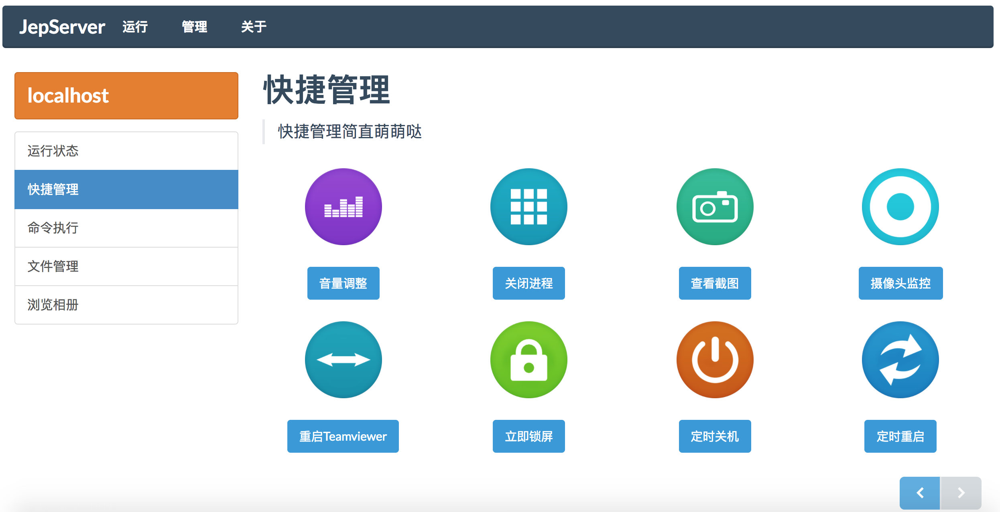
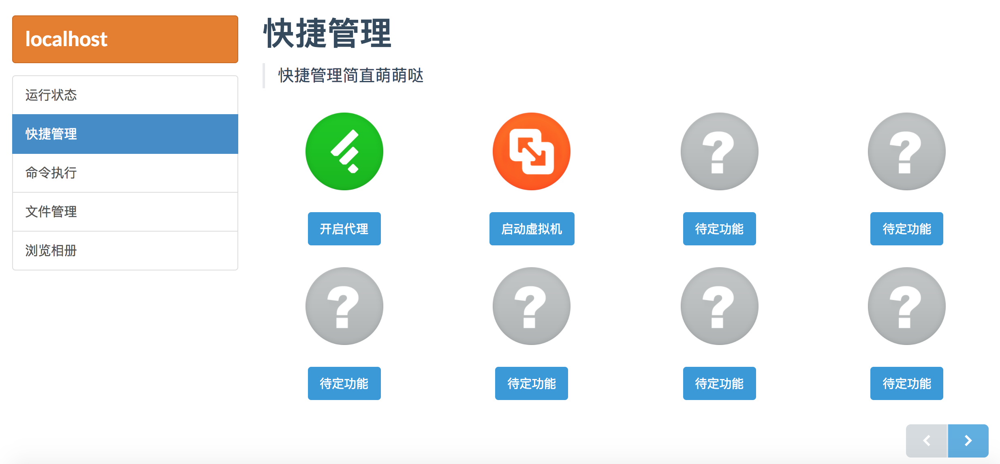
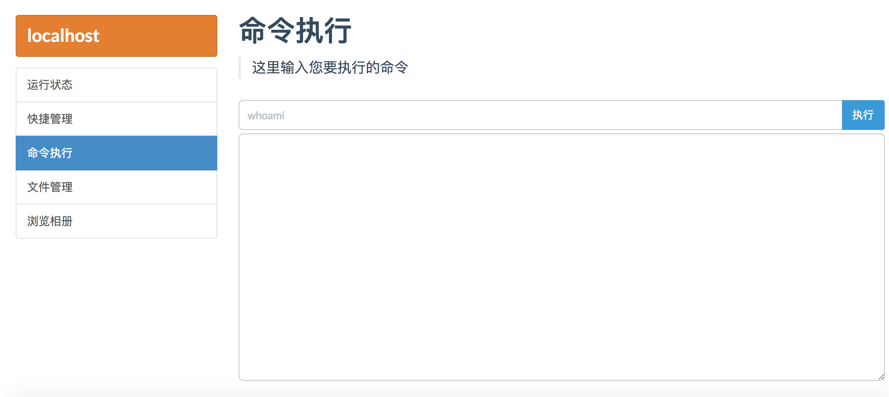
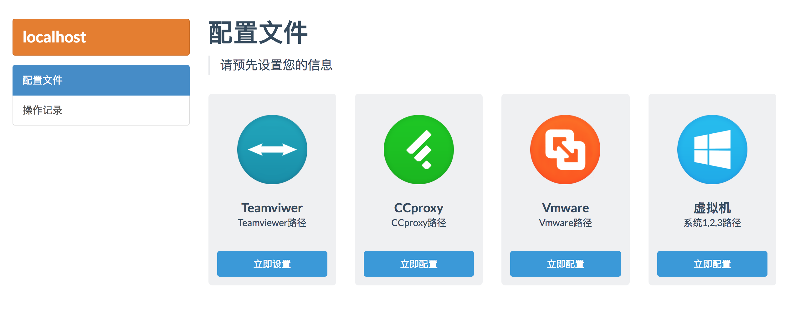
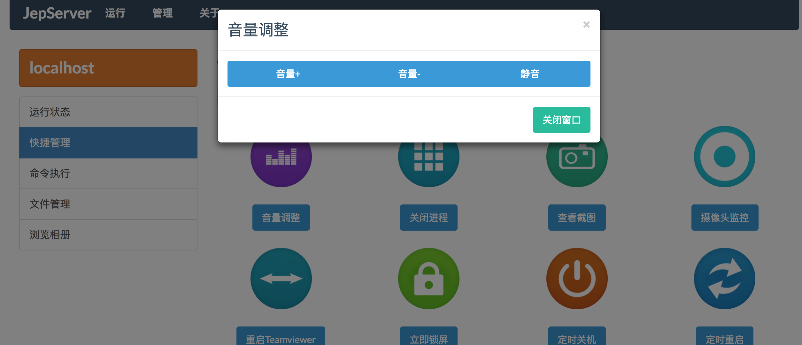
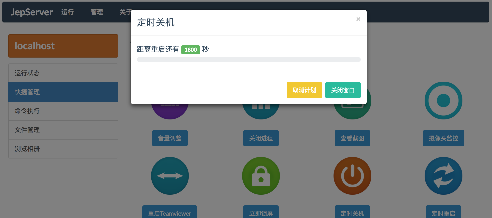
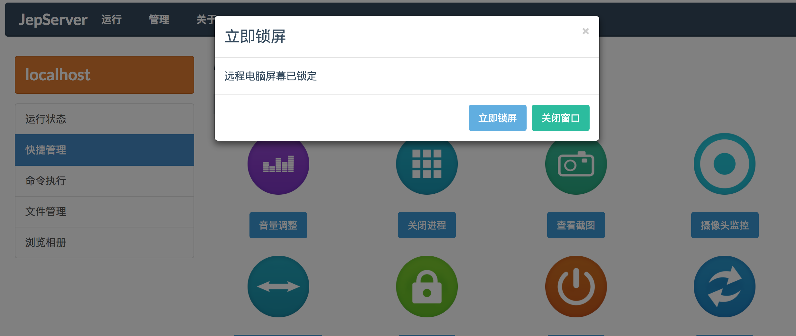

PejServer
===================

> 本项目目前已经停止维护

一个远程管理计算机工具箱，可以远程控制计算机锁屏、查看截图、关机、结束进程、虚拟机开机操作等。这是一个合法化的webshell管理web程序，能够快速的通过web端管理自己的电脑。

本项目代码写于2014年年初，在本人读大二时期，在Github上创建于 2014年9月，目标在于通过远程访问固定IP达到web端控制电脑，本项目的创建于存在是有一定的小故事的。

代码现在尚无维护、代码也未使用框架，不管是否存在安全问题，本程序是纯粹的功能性程序，不是为了展示给外人看的，纯粹自用，所以勿喷~欢迎 pull request。

目前兼容操作系统windows xp - windows 10，暂时不兼容Mac操作系统，如果存在编码问题（锟斤拷锟斤拷锟斤拷锟斤拷），请把浏览器的编码调成GBK。

前端 Flat UI

后端 PHP + 自己写的无窗口的应用程序

## 目标

* 躺在床上控制电脑关机、锁屏、调节音量、关闭程序
* 在学校的任意角落控制电脑
* 在异地如果Teamviewer不可用，可以用这个远程重启Teamviewer
* 在异地打开Vmware虚拟机的任意操作系统
* 在异地打开HTTP代理软件

## 为什么使用GBK

我很想用UTF-8，因为在写的过程中，exec()所返回来的结果是GBK的，曾经尝试强制转换为UTF-8等各种方式，发现均无果后，可能是当时由于本人技术不成熟，临时采用的解决方案就是把所有文件都转换成了GBK，所以看起来似乎有些非标准化，请谅解。

## 截图

